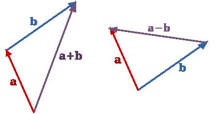
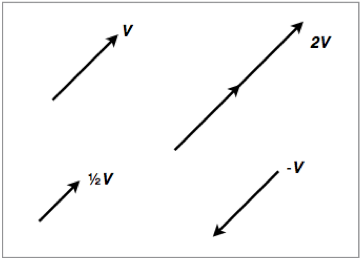

% Linear Algebra Day 1
% [Brian J. Mann](brian.mann@galvanize.com)
% Feb 10-11, 2016

# Vector Spaces

## Vectors

You've hopefully seen the concept of a *vector* before (maybe in physics or calculus)

* An $n$-dimensional vector is represented as a list of numbers $(x_1, x_2, \ldots, x_n)$ like $(5, -2, 3)$
* They can be added and subtracted, and multiplied by *scalars* (just real numbers)

## Vector Spaces

While we'll mostly be working with vectors that are lists of numbers, it can helpful to understand that concept of a vector space. If you get confused, just keep the familiar example on the last slide in mind.

* A *vector space* is a set $V$ of *vectors*, together with an addition operator $+$ and scalar multiplication
* There's a zero vector $\mathbf{0}$ in $V$ so that $\mathbf{v} + \mathbf{0} = \mathbf{v}$
* Vector addition is commutative $\mathbf{v} + \mathbf{w} = \mathbf{w} + \mathbf{v}$
* Any vector $\mathbf{v}$ has an inverse vector $-\mathbf{v}$ so that $\mathbf{v} + (-\mathbf{v}) = \mathbf{0}$

## Example (Vector Space 1/3): $\mathbb{R}^N$

This is the vector space you should already be familiar with

* $\mathbb{R}^N$ consists of $N$-tuples of real numbers $(x_1, \ldots, x_N)$
* Addition: $(x_1, x_2, \ldots, x_n) + (y_1, y_2, \ldots, y_n) = (x_1 + y_1, \ldots, x_n + y_n)$
* Scalar multiplication: $c (x_1, \ldots, x_n) = (cx_1, \ldots, cx_n)$
* What's $\mathbf{0}$?

## Example (Vector Space 2/3): Polynomials of degree $\leq 3$

Something a little more abstract!

* A polynomial looks like $4x^3 - 5x^2 + 3x + 1$
* More general: $ax^3 + bx^2 + cx + d$
* The coefficients can be zero!!!! For example $2x^2 + 4$ is valid
* How to add? Scalar multiply?

## Example (Vector Space 3/3): Real functions of one real variable

Even more abstract!

* Things like $f(t) = e^t$ or $f(t) = t^2$ or $f(t) = |t|$. Any function of one variable!
* How to add? Scalar multiply?

## Conventions

From now on we'll mostly stick to just $\mathbf{R}^n$ as our vector space

* A lower case bold letter $\mathbf{x}$ will always represent a vector
* A lower case unbolded letter $a$ will represent a scalar

## Geometric addition and multiplication (1/2)

Adding a vector is the same as placing one at the end of the other one:

{ width=200px }

## Geometric addition and multiplication (2/2)

Scaling a vector increases the length by a factor of the scalar, and reverses direction if negative:

{ width=200px }

## Vector magnitude

The *magnitude*, *norm*, or *size* or a vector (all of those mean the same thing) is $$||\mathbf{x}|| = \sqrt{x_1^2 + x_2^2 + \cdots + x_n^2}$$

## Example (Magnitude 1/2)

$$||(1, 0, 0)|| = \sqrt{1^2 + 0^2 + 0^2} = 1$$

A vector with $||\mathbf{x}|| = 1$ is called a *unit vector*

You can get a unit vector in the same direction as a vector $||\mathbf{x}||$ by computing $$\mathbf{u} = \frac{1}{||\mathbf{x}||}\mathbf{x}$$

## Example (Magnitude 2/2)

$$||(3, 4, 0)|| = \sqrt{3^2 + 4^2} = 5$$

## Check for Mastery

What is $||(-1, 4, 2)||$? What's the unit vector in the same direction?

## Dot Product

We can add vectors and multiply by scalars, but is there a way to "multiply" vectors? The answer is "sort of"...

* The *dot product* of $\mathbf{x}$ and $\mathbf{y}$ is $$\mathbf{x} \circ \mathbf{y} = x_1y_1 + x_2y_2 + \cdots + x_ny_n$$

## Example (Dot Product)

$(1,0) \circ (0,1) = (1)(0) + (0)(1) = 0$

When $\mathbf{x} \circ \mathbf{y} = 0$, we say $\mathbf{x}$ and $\mathbf{y}$ are *orthogonal*.

## Check for Mastery

What is $(3,1,-2) \circ (0,1,5)$?

## Cosine Formula for Dot Product

It turns out that if $\theta$ is the angle between $\mathbf{x}$ and $\mathbf{y}$

$$ \mathbf{x} \circ \mathbf{y} = ||\mathbf{x}|| \cdot ||\mathbf{y}|| \cos{\theta}$$

So, if $\mathbf{x}$ and $\mathbf{y}$ are perpendicular, then $\mathbf{x} \circ \mathbf{y} = 0$. This explains the defintion of *orthogonal*!

## Check for Mastery

What the angle between $(1,0)$ and $(1, \sqrt{2})$?

## Cosine Formula and Magnitude

Since the angle between $\mathbf{x}$ and itself is $0$, we have $$\mathbf{x} \circ \mathbf{x} = ||\mathbf{x}||^2$$
