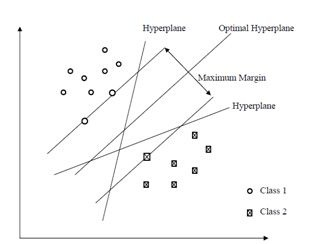
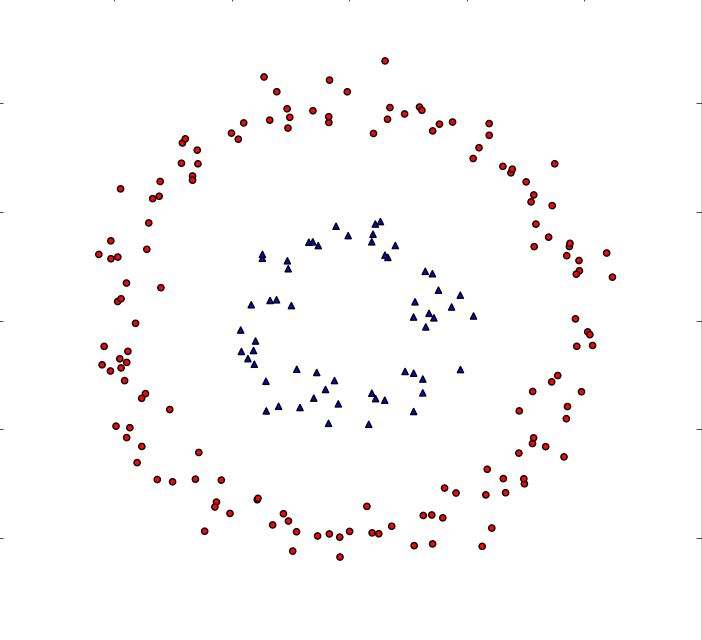
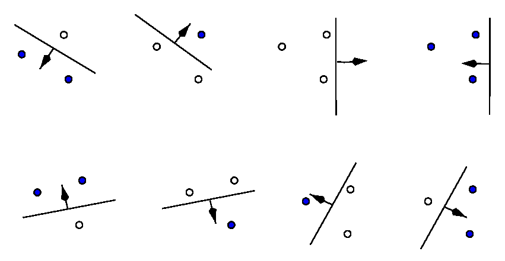
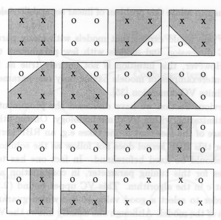

% Mathematics For Data Science
% [Brian J. Mann](brian.mann@galvanize.com)
% Feb 2, 2016

## Who am I?

* PhD from University of Utah in 2014 (Geometric Group Theory)
* Worked for [Amazon Web Services](http://aws.amazon.com) doing supply chain optimization and forecasting
* Now at [Galvanize](http://www.galvanize.com) teaching data science and consulting
* [Slides](https://github.com/brianmanngalvanize/UtahGSACTalk/blob/master/slides/math_for_data_science.pdf)
* brian.mann@galvanize.com

## Support Vector Machines (SVM)

* Idea: try to separate classes by an optimal hyperplane
* Here *optimal* means that the minimum distance from the hyperplane to any of the training points (the *margin*) is maximal.

{ width=250px }

## Ok, that sounds great. What's the problem?

{ width=250px }

## The solution

* Map our data to a higher dimensional space where it's (almost) linearly separable

{ width=250px }

## Talk's over, right?

* Not quite, there's still some problems

## Issue 1: Memory

* Even for polynomial transformations, the numbers of dimensions (features) in the target space can grow very quickly
* Consider the transformation $\phi: \mathbb{R}^2 \rightarrow \mathbb{R}^5$ given by $$(x_1, x_2) \mapsto (x_1^2, x_1x_2, x_2^2, x_1, x_2, 1)$$
* More generally, a mapping $\phi_d: \mathbb{R}^N \rightarrow \mathbb{R}^{N+d \choose d}$ that maps a vector to the vector of all monomial terms in $N$ variables of degree $\leq d$
* $N+d \choose d$ grows *very* quickly as $d >> 0$

## Issue 2: Computation

* The optimal hyperplane for the transformed data is $$f(x) = \sum_i a_i \cdot \langle \phi(x_i), \phi(x) \rangle + b = 0$$
* Need to compute the dot product of high-dimensional vectors (in fact, sometimes they might be infinite dimensional!)

## A solution

* What if there was a way to compute $\langle \phi(x), \phi(y) \rangle$ directly without ever computing $\phi(x)$ or $\phi(y)$?
* There is!
* This is what *kernel functions* do for us

## Kernels

* Make $\phi$ implicit
* This implicit $\phi$ might have an infinite dimensional target vector space

## What is a kernel function?

A *kernel function* is a continuous function $$K: \mathbb{R}^N \times \mathbb{R}^N \rightarrow \mathbb{R}$$ which satisfies

1. $K(x,y) = K(y,x)$ (symmetric)
2. $K$ is positive-semidefinite i.e. $$\sum_i \sum_j K(x_i, x_j)c_ic_j > 0$$ for all finite sequences $x_1,\ldots, x_n$ and all $c_i, c_j \in \mathbb{R}$

## Mercer's Theorem

*Mercer's Theorem* says that if $K : \mathbb{R}^N \times \mathbb{R}^N \rightarrow \mathbb{R}$ is a kernel function, then there exists a vector space with an inner product (a *Hilbert space*) $V$ and a mapping $\phi: \mathbb{R}^N \rightarrow V$ so that $$K(x,y) = \langle \phi(x), \phi(y) \rangle$$

* In English, if $K$ is a kernel function, it consists of a transformation followed by an inner product in some higher dimensional space $V$.

* Kernels allow us to compute high-dimensional inner products in $V$ in terms of our original inputs in $\mathbb{R}^N$.

## Example: Polynomial kernel

* $K(x,y) = (\langle x, y \rangle + c)^d$
* $c$ and $d$ are chosen *a priori* by the user, not trained
* Comes from the polynomial transformation $\phi_d$ (ignoring some constants)

{ width=200px }

## Example: RBF (Gaussian) kernel

* $K(x,y) = \exp(-\gamma||x - y||^2)$
* $\gamma$ is chosen *a priori* by the user

## More RBF kernel
What are $\phi$ and the dimension of $V$ in this case?

* Let $\gamma = 1/2$ for ease of computation, then $$\displaystyle K(x,y) = \sum_{j=0}^{\infty} \frac{\langle x,y \rangle^j}{j!} \exp(\frac{-||x||^2}{2}) \exp(\frac{-||y||^2}{2})$$
* With a little algebra one gets $$\displaystyle \phi(x) = \left(\frac{e^{-\frac{||x||^2}{2j}}}{\sqrt{j!}^{1/j}} {j \choose n_1,\ldots,n_k}^{1/2}\right)_{j=0,\ldots, \infty, \sum_{i=1}^k n_i= j} $$
* $V$ is infinite dimensional ($V = l^2$ the space of square-summable sequences)

## More RBF kernel

{ width=200px }

## Questions?

## VC Dimension and the VC Bound Theorem

### Question?

* Why should you expect that your training error tells you anything about the error of your model on new data? In other words, why/how do you know that your model will generalize at all?

## We need to start somewhere

### Theorem (Hoeffding Inequality)

Suppose $X_1, \ldots, X_n$ are iid random variables and let $$\bar{X} = \frac{X_1 + X_2 + \cdots + X_N}{N}$$ then $$\mathbb{P}(|\bar{X} - \mathbb{E}(\bar{X})| > \epsilon) \leq 2e^{-2\epsilon^2N}$$

## In English

* For any threshold value $\epsilon$, if you sample a random variable enough times, the probability that the sample mean differs from the true mean by more than $\epsilon$ is nearly 0.

* i.e. If you flip a fair coin enough times, you expect the ratio of heads to tails get arbitrarily close to 1:1 with high probability.

## Assumptions

* For the purposes of this talk, we'll focus on binary classification problems
* All of this can be extended to other supervised learning problems
* Positive and negative classes will be represented as $+1$ and $-1$

## What does this have to do with machine learning?

* Suppose $h$ is some hypothesis (a function that classifies observations as either $+1$ or $-1$)
* $E_{train}(h) =$ error rate on your training set
* $E_{gen}(h) = h$'s true error rate

$E_{gen}(h)$ and $E_{train}(h)$ are random variables that satisfy the hypotheses of the Hoeffding Inequality so $$\mathbb{P}(|E_{train}(h) - E_{gen}(h)| > \epsilon) \leq 2e^{-2\epsilon^2N}$$

## Naive error generalization bound

Suppose:

1. We have a finite hypothesis set $\{h_1, \ldots, h_M\}$
2. Given some training data, we apply some learning procedure to find the optimal hypothesis $g$

It is NOT TRUE that $$\mathbb{P}(|E_{train}(g) - E_{gen}(g)| > \epsilon) \leq 2e^{-2\epsilon^2N}$$ since $g$ is chosen after the data is generated

## Naive error generalization bound

However, the event $$|E_{train}(g) - E_{gen}(g)| > \epsilon$$ is in the union of the events $$|E_{train}(h_i) - E_{gen}(h_i)| > \epsilon$$ so $$\mathbb{P}(|E_{train}(g) - E_{gen}(g)| > \epsilon) \leq 2Me^{-2\epsilon^2N}$$

## Problem with this naive bound

* The bound $$\mathbb{P}(|E_{train}(g) - E_{gen}(g)| > \epsilon) \leq 2Me^{-2\epsilon^2N}$$ only works for finite hypothesis sets
* Not really useful for any real-world examples

## Can we do better?

* How do we make this idea work?
    * Even with finitely many hypothesis functions the bound is still quite bad since the events $$|E_{train}(h_i) - E_{gen}(h_i)| > \epsilon$$ probably have large overlaps
    * In fact, they overlap enough to allow us to work with infinite hypothesis sets (i.e. hyperplanes in $\mathbb{R}^N$)

## Shattering

* Let $\mathcal{H}$ be our hypotheses set
    * $\mathcal{H}$ might be all separating hyperplanes in $\mathbb{R}^N$
    * or the set of all of the possible decision functions you can get with a neural network of some fixed topology

* For any finite data set $\{x_1, \ldots, x_N\}$, each $h \in \mathcal{H}$ gives a dichotomy $h(x_1), \ldots, h(x_N) \in \{+1, -1\}^N$
* Define $$m_{\mathcal{H}(N)} = \max_{x_1, \ldots, x_N} | \{h(x_1), \ldots, h(x_N) | h \in \mathcal{H}\}|$$

## Shattering

* $m_{\mathcal{H}}(N) \leq 2^N$
* We say $\mathcal{H}$ *shatters* $x_1, \ldots, x_N$ if $| \{h(x_1), \ldots, h(x_N) | h \in \mathcal{H}\}| = 2^N$
* In this case $m_{\mathcal{H}}(N) = 2^N$

## Examples
* Linear decision boundaries shatters 3 points in $\mathbb{R}^2$
{width=200px}
* Convex polgons in $\mathbb{R}^2$ shatter arbitrarily many points
    * Choose $N$ points on the unit circle
    * Take the convex hull of the $+1$'s

## Non-example
* Linear decision boundaries do not shatter any 4 points in $\mathbb{R}^2$
{width=200px}

## Vapnik-Chervonenkis (VC) Dimension

* The VC Dimension $d_{VC}$ of $\mathcal{H}$ is defined to be the largest $N$ for which $m_{\mathcal{H}}(N) = 2^N$
* Said another way $$d_{VC} \geq N$$ $$\Leftrightarrow$$ $$\text{ there exists a data set of size $N$ such that } \mathcal{H} \text{ shatters it}$$
* The VC Dimension gives a polynomial upper bound on $m_{\mathcal{H}}(N)$ $$m_{\mathcal{H}(N)} \leq N^{d_{VC}} + 1$$

## Examples

* For linear decision boundaries in $\mathbb{R}^2$, $d_{VC} = 3$
* For linear decision boundaries in $\mathbb{R}^N$, $d_{VC} = N+1$
    * Choose $N+1$ points which do not live on the same hyperplane
    * Can get any dichotomy on these points, so $d_{VC} \geq N+1$
    * With $N+2$ points, can find hyperplane through $N$ points with the remaining two points on either side
    * Labelling points on this hyperplane $-1$, others $+1$ $\Rightarrow$ impossible dichotomy
    * $d_{VC} = N+1$
* Convex polygons in $\mathbb{R}^2$ have $d_{VC} = \infty$

## The VC Bound

The VC generalization bound states that for any $\epsilon > 0$  $$E_{gen}(g) \leq E_{train}(g) + \sqrt{\frac{8}{N}\ln{\frac{4m_{\mathcal{H}}(2N)}{\epsilon}}}$$ with probability $1 - \epsilon$

## What does this tell us?

1. Since $m_{\mathcal{H}}(N)$ is bounded by a polynomial of degree $d_{VC}$ in $N$, the RHS of $$E_{gen}(g) \leq E_{train}(g) + \sqrt{\frac{8}{N}\ln{\frac{4m_{\mathcal{H}}(2N)}{\epsilon}}}$$ $\rightarrow E_{train}(g)$ as the size of the training set increases
2. Since $m_{\mathcal{H}}(N)$ or $d_{VC}$ is a measure of model complexity, more complicated models make the bound worse (overfitting!!!!)

## Examples

Suppose we want $E_{gen}(g)$ to be within 10% of $E_{train}(g)$ with 90% confidence for a model with $d_{VC} = 3$. How much data do we need?

* From the VC Bound $$\sqrt{\frac{8}{N}\ln{ \frac{4m_{\mathcal{H}}(2N)}{0.9}}} \leq 0.1$$

* So $$N \geq \frac{8}{0.1^2} \ln \left( \frac{4(2N)^3 + 4}{0.1}\right)$$

* $N \sim 30,000$

* It turns out that $N \sim 10,000 \times d_{VC}$

* Empirically, $N \sim 10 \times d_{VC}$ (VC bound badly overestimates)

## Sketch of Proof

## References

* Yaser S. Abu-Mostafa, Malik Magdon-Ismail, Hsuan-Tien Lin *Learning From Data: A Short Course*
* *http://www.svms.org/vc-dimension/*
